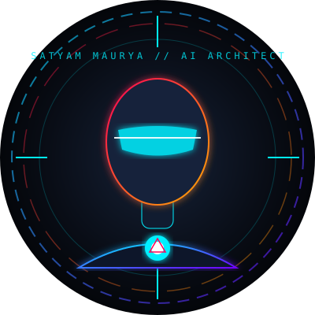

# Satyam Maurya | 3D Marvel Tech Developer Portfolio 🚀



A world-class, futuristic, dark-mode 3D Marvel Stark Industrial & JARVIS HUD inspired portfolio website built for **Satyam Maurya**.

Designed with pure **HTML5**, **CSS3**, and **Vanilla JavaScript** (enhanced with Three.js 3D graphics), this website is 100% framework-free, highly optimized, responsive, and ready for instant deployment on **GitHub Pages**.

---

## 🌟 Developer Information

- **Name**: Satyam Maurya
- **Roles**:
  - 🤖 AI App Developer
  - 📱 Flutter Developer
  - 💻 Frontend Web Developer
  - 🎨 Graphic Designer
  - 📊 Power BI Enthusiast
- **Portfolio URL**: [https://satyam-ai18.github.io](https://satyam-ai18.github.io)
- **GitHub**: [https://github.com/satyam-ai18](https://github.com/satyam-ai18)
- **LinkedIn**: [https://linkedin.com/in/satyam-maurya-77a269367](https://linkedin.com/in/satyam-maurya-77a269367)
- **Instagram**: [https://instagram.com/satyam_maurya0411](https://instagram.com/satyam_maurya0411)
- **Email**: [aaryasam94@gmail.com](mailto:aaryasam94@gmail.com)

---

## 🔥 Key Design & Technical Features

1. **Stark Tech Marvel Aesthetic**:
   - Deep space dark background (`#04060a`, `#0d111d`) with neon cyan (`#00f0ff`), arc reactor crimson (`#ff0055`), and Stark gold (`#ffb700`) accents.
   - Dark glassmorphism (`backdrop-filter: blur(16px)`), Marvel HUD corner brackets, and scanner light bars.

2. **3D Three.js Background Particle Engine**:
   - Interactive 3D particle universe mesh that dynamically rotates and reacts to cursor coordinates in real-time.

3. **JARVIS Loader Sequence**:
   - Sci-fi loading screen featuring an Arc Reactor spinner animation, progress bar, and percentage counter.

4. **Custom 3D Cursor**:
   - Hardware-accelerated cursor dot and trailing glow halo with hover scaling on buttons and cards.

5. **Dynamic Multi-Role Typing Engine**:
   - Smooth typewriter effect cycling through Satyam's developer titles.

6. **Vanilla 3D Card Tilt Interaction**:
   - Perspective 3D rotation math on mouse movement with light reflection effects on cards.

7. **Filterable Projects Matrix**:
   - Instant project filtering across categories: `All Projects`, `AI Projects`, `Flutter Apps`, `Web Projects`, and `Power BI Dashboards`.

8. **Live GitHub Telemetry & Stats**:
   - Displays real-time GitHub stats, coding streak, contribution activity, and top language badges for `@satyam-ai18`.

9. **Holographic Contact Terminal**:
   - Form with input glow feedback, direct mail copy button, and interactive alert notifications.

10. **Sci-Fi Ambience Sound Synthesizer**:
    - Optional ambient tone toggle built using the native Web Audio API.

---

## 🛠️ Tech Stack & Requirements

- **HTML5**: Semantic tags, accessibility attributes, OpenGraph metadata.
- **CSS3**: CSS Custom Properties (Variables), Flexbox, CSS Grid, Glassmorphism, 3D Transforms, CSS Keyframe Animations.
- **Vanilla JavaScript (ES6+)**: Three.js integration, IntersectionObserver, Web Audio API, Clipboard API.
- **Zero Heavy Frameworks**: No React, Vue, Angular, Bootstrap, Tailwind, or jQuery.

---

## 📁 File Structure

```text
c:/Users/aarya/OneDrive/Desktop/Port/
├── index.html            # Main semantic HTML5 markup with Marvel HUD sections
├── style.css             # Design system, glassmorphic UI, responsive layout
├── script.js             # Three.js 3D universe, cursor tracking, typing effect, card tilt
├── assets/
│   ├── images/
│   │   └── avatar.svg    # Stark HUD holographic developer illustration
│   └── icons/
│       └── arc-reactor.svg # Arc Reactor SVG logo asset
└── README.md             # Project documentation & deployment guide
```

---

## 🚀 How to Run Locally

1. Clone or download this repository to your local computer:
   ```bash
   git clone https://github.com/satyam-ai18/satyam-ai18.github.io.git
   ```
2. Navigate into the directory:
   ```bash
   cd satyam-ai18.github.io
   ```
3. Open `index.html` directly in any web browser (or use VS Code Live Server extension).

---

## 🌐 How to Deploy to GitHub Pages

1. Create a new repository on GitHub named **`satyam-ai18.github.io`** (or push to an existing repository).
2. Initialize git and commit your files:
   ```bash
   git init
   git add .
   git commit -m "Deploy 3D Marvel Tech Portfolio Website"
   git branch -M main
   git remote add origin https://github.com/satyam-ai18/satyam-ai18.github.io.git
   git push -u origin main
   ```
3. Go to your repository settings on GitHub:
   - Click **Settings** > **Pages**.
   - Under **Build and deployment** > **Branch**, select `main` branch and `/ (root)` folder.
   - Click **Save**.
4. Your world-class portfolio will be live at: **[https://satyam-ai18.github.io](https://satyam-ai18.github.io)** 🎉

---

## 📝 License & Credits

Designed & Engineered with ❤️ for **Satyam Maurya**.  
© 2026 Satyam Maurya. Built with Stark Tech 3D Marvel Edition aesthetics.
